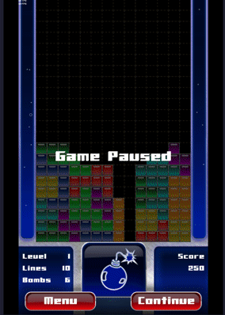
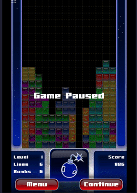

# Jam Jam 2024

Recently stumbled across my old sources for a Tetris-with-Bombs game I've made
back in 2008. Back then it ran on J2ME (can you believe it?), desktop
Android. This is the port to Flutter.

**WORK IN PROGRESS**

The game features many extras that can be activated by dropping tiles onto
them. Extras will give you extra score points, or blast away blocks. Plus
various other effects.

One central idea of the game is blasting blocks away to clean up messy
situations or to simply get through a messy situation. If you have a bomb
available, you can detonate the currently dropping tile.

Controls (at the time of this writing):

- Left Control for the "button" on the bottom left
- Right Control for the "button" on the bottom right
- Space or "j" to drop the current tile
- Enter or "k" to detonate the current tile
- Arrow Down or "s" to move the current tile one block down
- Arrow Up or "w" to rotate the current tile
- Arrow Left or "a" to move the current tile one block left
- Arrow Right or "d" to move the current tile one block right

### To Do

- Enter Hiscore
- Load/Save Hiscore
- Options Screen
- Controls (Info) Screen
- Audio Screen (Play Music and Disable Sounds)

### Playable Web Version

https://intensicode.github.io/jamjam24/

### Screenshots

